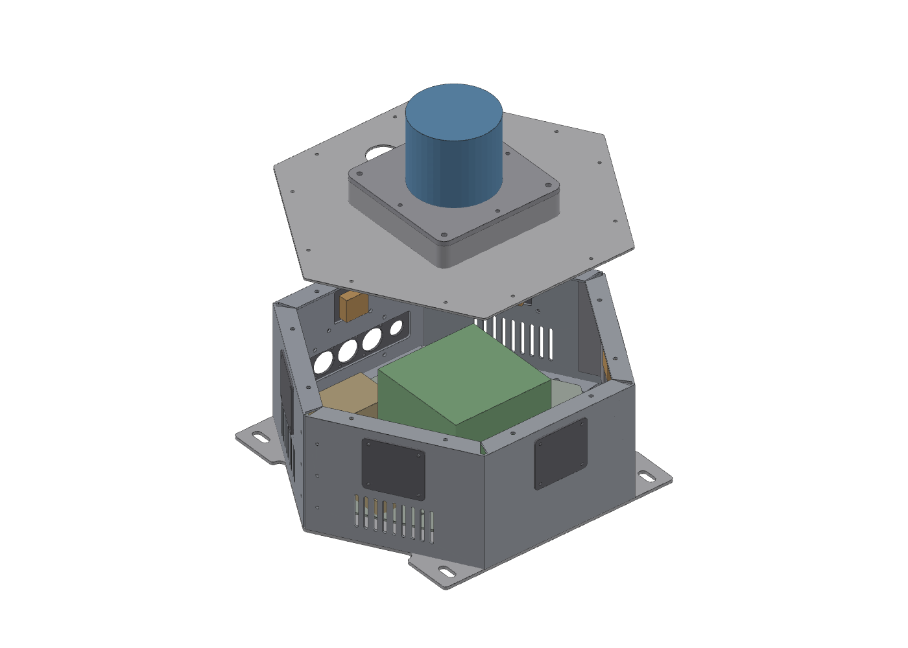
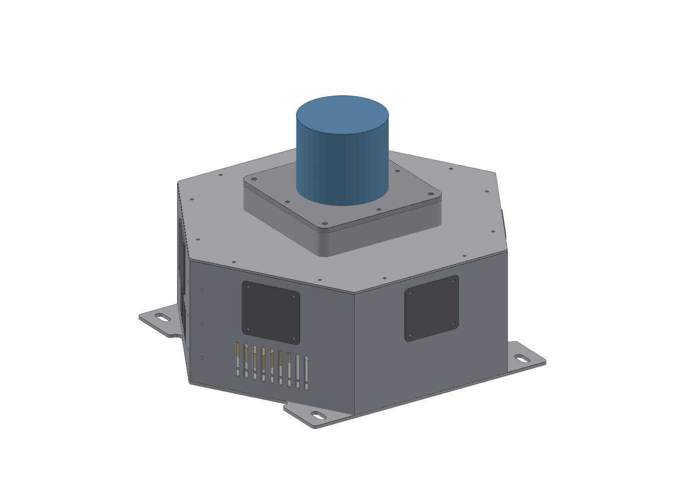
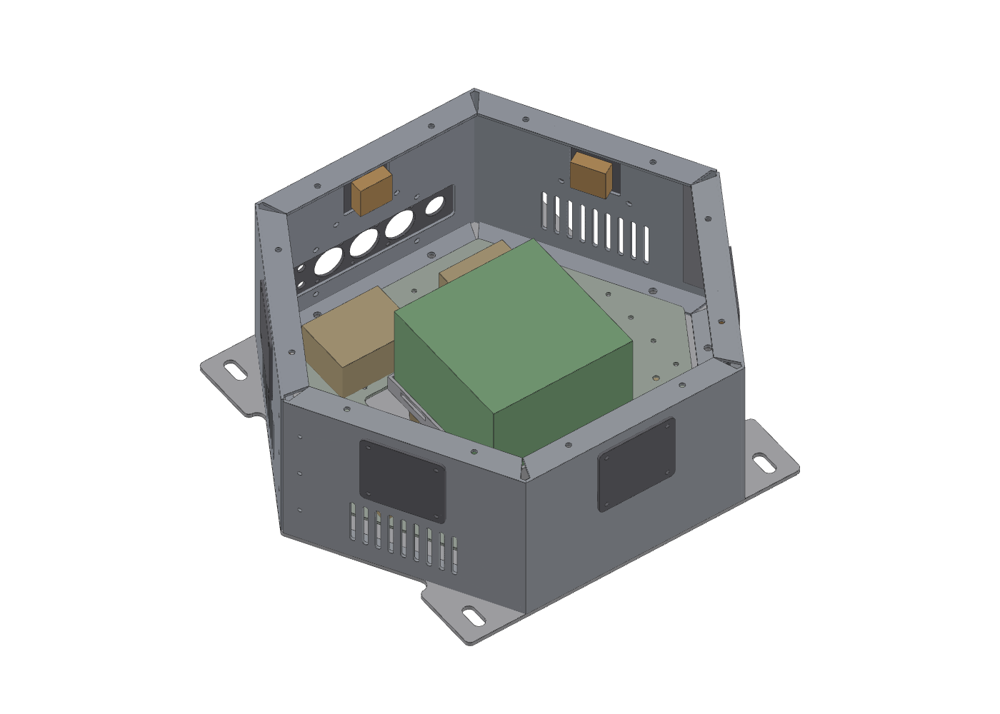

# SCOUT MINI OMNI Sensor / Compute Enclosure (KETI)

Single-source parametric CAD for a hexagonal sheet-metal box that sits on an AgileX **SCOUT MINI (OMNI)** robot and carries an **Ouster OS1** lidar, a **Jetson AGX Orin**, up to six **Arducam B0473** cameras, and the power/CAN electronics. REV 9 is the final version sent out for quotation (RFQ).



| | |
|---|---|
|  |  |

## Design at a glance

- Hexagon 300 mm across flats, 130 mm tall; AL5052-H32 sheet (2 mm walls/cover, 3 mm floor), AL6061-T6 for the lidar plate and riser.
- Walls are two bent halves (C1–C3, C4–C6) joined by splice brackets, so each half fits a standard press brake.
- Self-clinching (PEM) fasteners throughout; bend allowances use Ri 2.0 / K 0.40, and the vendor re-flattens with their own bend deduction before cutting.
- Vents on C1/C3/C4/C6 for the AGX airflow, rear service panel on C5, removable electrical plate (P10).
- Items that depend on measuring real hardware (camera holder holes, OS1 pin pattern, rail slot pitch, DC/DC spec) are marked **HOLD**: those parts are delivered blank and finished in-house.

| Part | Name | Material / t |
|---|---|---|
| P01 | Bottom plate | AL5052 3.0 |
| P02 / P03 | Wall half, front / rear | AL5052 2.0 |
| P04 | Top cover | AL5052 2.0 |
| P05 | OS1 mount plate | AL6061 5.0 |
| P06 | Camera adapter plate (×8) | AL5052 2.0 |
| P07 | Rear service panel | AL5052 2.0 |
| P08 | AGX tray | AL5052 2.0 |
| P09 | Wall splice bracket (×2) | AL5052 2.0 |
| P10 | Electrical plate | AL5052 2.0 |
| P11 | OS1 riser frame | AL6061 25 |

## Files

`geom.py` is the only source of geometry. Everything in `out/` is generated from it:

| Script | Output |
|---|---|
| `geom.py` | all geometry: flat patterns, holes, PEM, bends |
| `model3d.py` | CadQuery 3D model → `out/step/*.step` |
| `dxfout.py` | laser-cut DXF → `out/dxf/*.dxf` (CUT / BEND / NOTE layers) |
| `drc.py` | design-rule check: PEM-to-edge and PEM-to-bend distance, hole spacing |
| `drawlib.py`, `sheets_a.py`, `sheets_b.py`, `build_pdf.py` | 10-sheet A3 drawing set → `out/SBOX_REV9_DRAWINGS.pdf` |
| `bom.py` | BOM / RFQ workbook → `out/SBOX_REV9_BOM.xlsx` |
| `shoot.py` + `web/render.html` | three.js renders → `out/*.png` (optional) |

## Rebuild

```bash
python3 -m venv .venv && . .venv/bin/activate
pip install -r requirements.txt

python3 model3d.py                          # STEP (+ out/tess.pkl for renders), ~30 s
python3 dxfout.py                           # DXF
python3 drc.py                              # must print "DRC issues: 0"
python3 build_pdf.py out/SBOX_REV9_DRAWINGS.pdf
python3 bom.py
```

Renders (optional; needs Node and Playwright):

```bash
(cd web && npm install) && pip install playwright && playwright install chromium
python3 shoot.py
```

The drawings need a Hangul font: Noto Sans CJK on Linux, Apple SD Gothic Neo on macOS, or Malgun Gothic on Windows is picked up automatically.

---

**한국어 요약:** SCOUT MINI 로봇 위에 올리는 육각 판금 센서/컴퓨트 박스(라이다 OS1, Jetson AGX Orin, 카메라 6대) 설계 소스입니다. `geom.py` 하나에서 STEP·DXF·도면 PDF·BOM이 모두 생성되고, REV 9는 견적용 최종판입니다.
